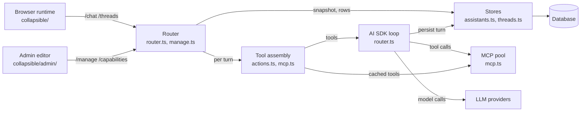
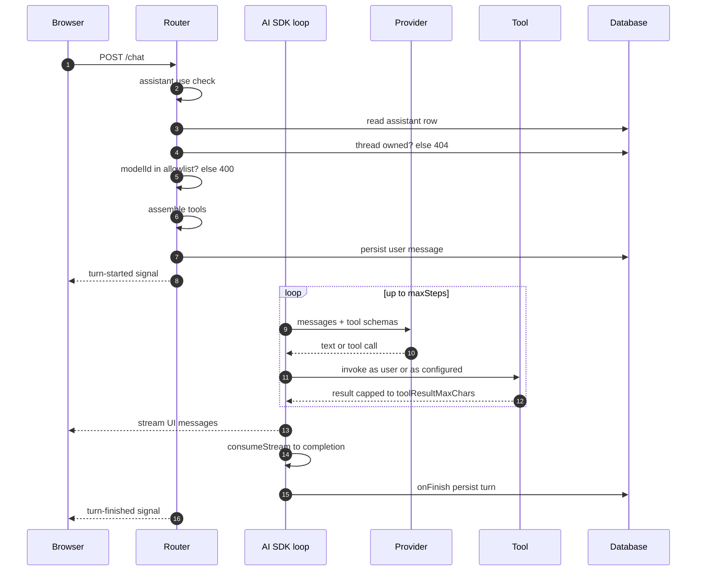
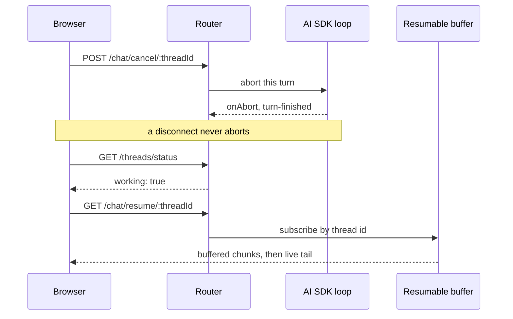
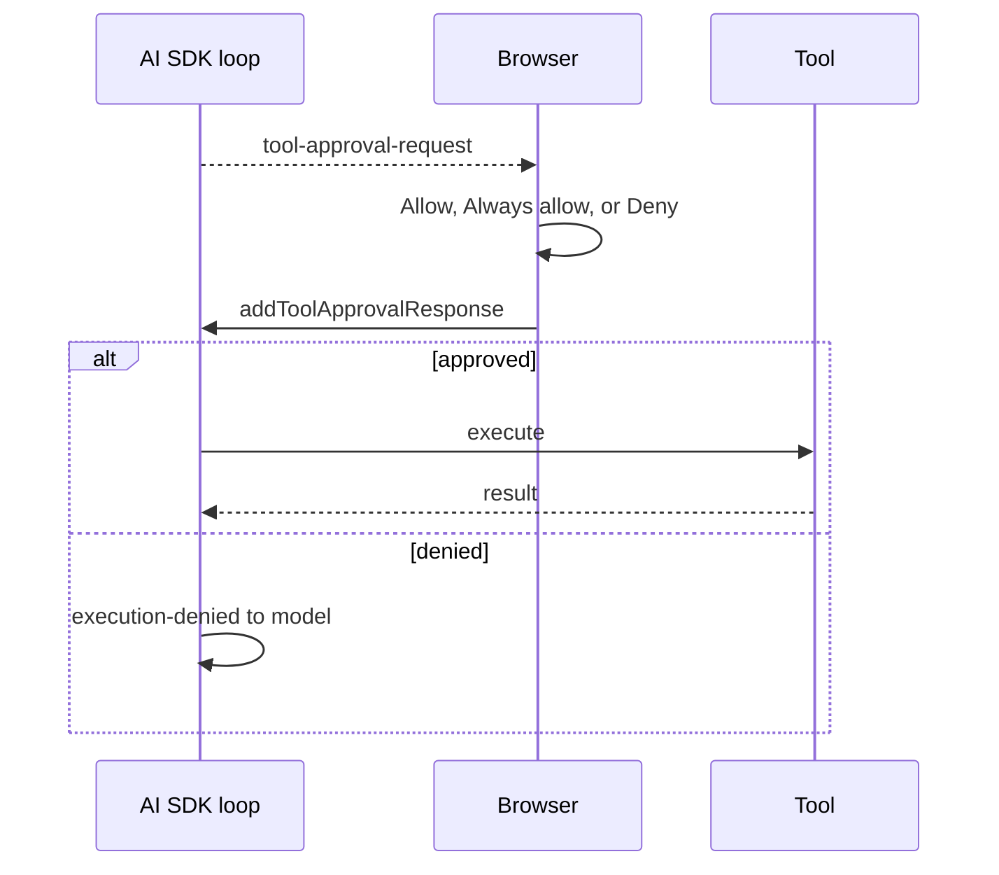
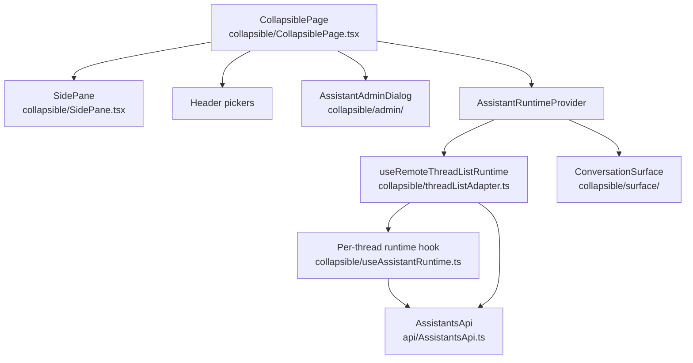
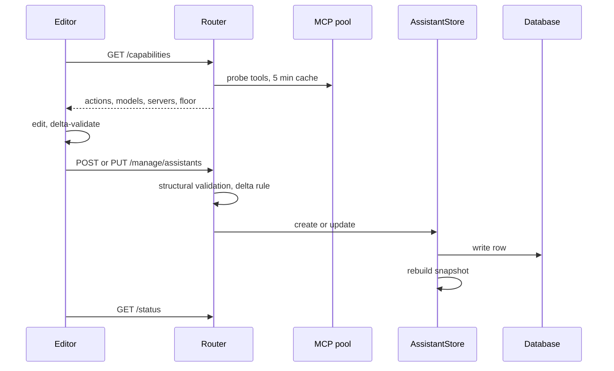

# Architecture

`backstage-assistants` is an in-portal AI chat for Backstage. assistant-ui renders the conversation, the Vercel AI SDK runs the model and tool loop, and Backstage supplies auth, the Actions registry, and the database; the plugin is thin glue between them. This file, [PRINCIPLES.md](PRINCIPLES.md), and [CONTEXT.md](../CONTEXT.md) are the spec, and a change to the design changes them in the same commit.

## Stack

| Package                                                                      | Role                                                                                                                   |
| ---------------------------------------------------------------------------- | ---------------------------------------------------------------------------------------------------------------------- |
| `@assistant-ui/react`, `-core`, `-react-markdown`                            | Message and tool-call primitives; `useRemoteThreadListRuntime` is the one runtime for every assistant and conversation |
| `@assistant-ui/react-ai-sdk`                                                 | `useAISDKRuntime` and `AssistantChatTransport`, the bridge from `useChat` to the runtime; `respondToApproval`          |
| `ai`, `@ai-sdk/react`                                                        | `streamText` tool loop, UI message streaming, `toolApproval`, persistence hooks; `useChat` on the client               |
| `@ai-sdk/openai`, `-anthropic`, `-azure`                                     | Provider factories selected by the configured `type`; OpenAI-compatible gateways use the `openai` factory              |
| `@backstage/backend-plugin-api/alpha` (Actions), `@ai-sdk/mcp`               | Backstage actions run as the user; MCP servers run as a configured credential; both become AI SDK tools                |
| `@rjsf/core`, `-utils`, `-validator-ajv8`, `plugin-scaffolder-react`         | Inline forms for `render_form`, rendering the host's scaffolder field extensions by name                               |
| `@backstage/backend-plugin-api`, `backend-defaults`, `backend-openapi-utils` | Plugin wiring, the typed OpenAPI router for `/status` and `/chat`, core services                                       |
| `coreServices.database` with `knex`                                          | The `threads`, `messages`, `assistants`, and `assistants_meta` tables on SQLite, Postgres, or MySQL                    |
| `@backstage/plugin-signals-node`, `-react`                                   | Real-time working and unread indicators; the browser polls when the host has no Signals API                            |
| `mermaid`, `remark-gfm`, `@material-ui/core` v4                              | Diagrams and GitHub-flavoured Markdown in replies; Backstage's component theme                                         |

The thread and composer components from assistant-ui's registry template are vendored under `packages/assistants/src/collapsible/surface/react-ui/` so they stay editable.

## System map

| Node            | Module path                                                   | Owns                                                                          |
| --------------- | ------------------------------------------------------------- | ----------------------------------------------------------------------------- |
| Browser runtime | `packages/assistants/src/collapsible/`                        | One `useRemoteThreadListRuntime` per tab, the chrome, the surface seam        |
| Admin editor    | `packages/assistants/src/collapsible/admin/`                  | The `assistant.manage` dialog and client-side delta-validation                |
| Router          | `packages/assistants-backend/src/router.ts`, `manage.ts`      | Auth, permission and access checks, `/status`, `/chat`, `/threads`, `/manage` |
| Tool assembly   | `packages/assistants-backend/src/actions.ts`, `mcp.ts`        | `allowedTools` to AI SDK tools; result capping                                |
| AI SDK loop     | `packages/assistants-backend/src/router.ts`                   | `streamText`, the approval map, persistence on start and finish, signals      |
| Stores          | `packages/assistants-backend/src/assistants.ts`, `threads.ts` | `AssistantStore` with its snapshot; `ThreadService`, the only message writer  |
| MCP pool        | `packages/assistants-backend/src/mcp.ts`                      | One client per server per process, the tool cache                             |
| Database        | Backstage `backend.database`                                  | The four plugin tables                                                        |
| LLM providers   | `packages/assistants-backend/src/config.ts`                   | The AI SDK provider registry built from config                                |

## Routes

Every route accepts user tokens only. `/chat` and `/threads*` also apply the per-assistant access policy. Handlers live in `router.ts`; `/capabilities` and `/manage/*` live in `manage.ts`.

| Method | Path                     | Gate               | Reads                                                | Writes                                          | Signals                              |
| ------ | ------------------------ | ------------------ | ---------------------------------------------------- | ----------------------------------------------- | ------------------------------------ |
| GET    | `/status`                | `assistant.use`    | snapshot, `actions.list`, MCP tool cache             |                                                 |                                      |
| POST   | `/chat`                  | `assistant.use`    | assistant row (DB), thread row, `actions.list`, pool | `messages`, `threads.updated_at`, title         | turn-started, turn-finished, updated |
| GET    | `/chat/resume/:threadId` | `assistant.use`    | resumable buffer                                     |                                                 |                                      |
| POST   | `/chat/cancel/:threadId` | `assistant.use`    | in-flight set, abort handle                          |                                                 | turn-finished                        |
| GET    | `/threads`               | `assistant.use`    | snapshot (access filter), `threads`                  |                                                 |                                      |
| POST   | `/threads`               | `assistant.use`    | snapshot (access check)                              | `threads` row                                   |                                      |
| GET    | `/threads/status`        | `assistant.use`    | snapshot, `threads`, in-flight set                   |                                                 |                                      |
| GET    | `/threads/:id`           | `assistant.use`    | `threads`                                            |                                                 |                                      |
| PATCH  | `/threads/:id`           | `assistant.use`    | `threads`                                            | title, model, reasoning level, pinned, archived |                                      |
| DELETE | `/threads/:id`           | `assistant.use`    | `threads`                                            | `threads` and `messages` rows                   |                                      |
| POST   | `/threads/:id/read`      | `assistant.use`    | `threads`                                            | `last_read_at`                                  | read                                 |
| GET    | `/threads/:id/messages`  | `assistant.use`    | `messages`                                           |                                                 |                                      |
| GET    | `/capabilities`          | `assistant.manage` | `actions.list`, model pool, MCP pool                 |                                                 |                                      |
| GET    | `/manage/assistants`     | `assistant.manage` | `assistants` (DB)                                    |                                                 |                                      |
| POST   | `/manage/assistants`     | `assistant.manage` | capabilities                                         | `assistants` row, snapshot rebuild              |                                      |
| PUT    | `/manage/assistants/:id` | `assistant.manage` | `assistants` row, capabilities                       | `assistants` row, snapshot rebuild              |                                      |
| DELETE | `/manage/assistants/:id` | `assistant.manage` |                                                      | `assistants` row, snapshot rebuild              |                                      |

`/status` and `/chat` sit on the typed OpenAPI router (`src/schema/openapi.yaml`); the `/chat` body limit is `requestBodyLimit`, default `10mb`. The other routes are plain Express sub-routers with `1mb` bodies.

## Chat turn

The browser sends `{ assistantId, modelId, threadId, reasoningLevel?, messages }`. The server persists the user message before streaming, so the conversation is durable the instant it is sent.

Tool assembly splits `allowedTools` into bare action ids and `<serverId>__<tool>` entries. Action ids are intersected with `actions.list({ credentials })`; unknown names are logged and skipped. MCP entries come from the pool cache and run as the server's configured credential. `render_form` and `download_file` are always added. Non-image file parts are inlined as `<attachment>` text before the model call. `reasoningLevel` (`low`, `medium`, `high`, `max`) is translated per provider type in `config.ts`.

The loop runs `streamText` with `stopWhen: stepCountIs(maxSteps)` (default 10) and one `AbortController` per thread. Usage from the last `finish-step` rides the assistant message as `metadata.usage`, and `replaceMessages` stores the total in `threads.last_tokens`. Errors stream as a readable error part with the real reason, capped at 300 characters.

**Auto-title.** After a turn lands, `onFinish` runs `generateText` off the critical path when the title is still `New Chat`. The result is cut to 80 characters, saved with `updateThread`, and announced with an `updated` signal.

### Cancel and resume

Stop aborts only this turn's controller, checked against the caller's in-flight set. A dropped connection does not abort: `consumeStream` drives the turn to completion and `onFinish` persists it. On entering a conversation the runtime hook checks the `working` flag and calls `resumeStream()`, which targets `/chat/resume/:threadId` with the thread id as the stream id. The buffer stays 60 s after completion; after that the route answers 204 and the durable turn loads from the database.

| End state    | Persisted                                        | Surface shows                                                              |
| ------------ | ------------------------------------------------ | -------------------------------------------------------------------------- |
| Stopped      | Partial reply, stamped `metadata.canceled: true` | "Request interrupted", live via `interruptedTurns`, durable via the flag   |
| Errored      | The user message from turn start                 | The streamed error part with the reason                                    |
| Disconnected | The full turn, written when the server finishes  | "Connection lost" in the tab that dropped; resume or reload shows the turn |

A clean close with no `finishReason`, outside a form or approval pause, is labelled as disconnected.

## Human in the loop

The approval gate is a global floor in config: `assistants.requireApproval` (action ids) ∪ each `mcp.servers.*.requireApproval` (tool names, folded in as `<serverId>__<tool>`). Per turn, the set is that floor ∩ the assistant's `allowedTools`. Each member gets a `toolApproval` entry, so the SDK emits `tool-approval-request` and skips `execute` until the user answers. Allow runs the tool under its normal identity; Deny returns an execution-denied result to the model. The gate withholds execution and never grants access; Backstage permissions still apply when an approved action invokes.

**Always allow** records an approved response with `reason: always:<tool>`. The `toolApproval` predicate reads it back from the message history, so that tool runs unprompted for the rest of the conversation. The grant is per tool and survives reloads because it lives in the persisted messages. Several gated calls of one tool in a single step collapse into one card with a count; the lowest-index call leads and the rest mirror its decision.

`render_form` and `download_file` are client-side tools with a schema and no server `execute`, so `streamText` yields to the browser. `render_form` renders through scaffolder's RJSF `Form` with the field registry from `formFieldsApiRef.loadFormFields()`; `ui:*` keys inside the schema are hoisted by `extractSchemaFromStep`. Submit returns `{ submitted: true, values }`; dismissal returns `{ submitted: false, cancelled: true }`. `download_file` renders a download chip. Neither is config-gated.

`sendAutomaticallyWhen` flushes the turn once every tool part in the latest step is settled and at least one is client-driven: a submitted form or an answered approval. A server tool truncated at `maxSteps` is never auto-resumed.

## Authorization

| Order | Layer                       | Where                                                 | Rule                                                                                                                                                                                 |
| ----- | --------------------------- | ----------------------------------------------------- | ------------------------------------------------------------------------------------------------------------------------------------------------------------------------------------ |
| 1     | `assistant.use` permission  | Every user-facing route; the page via `usePermission` | Denied callers get 403 and never load the surface                                                                                                                                    |
| 2     | Per-assistant access policy | `/status` filter, `/chat`, `/threads*`                | `allowAuthenticated`, or `users` contains the caller, or `groups` meets `ownershipEntityRefs`; deny by default. The API defaults a missing policy to deny; the editor pre-fills open |
| 3     | Tool selection              | Tool assembly                                         | Backstage actions: `allowedTools` ∩ `actions.list(credentials)`, with per-resource checks at `invoke`. MCP tools: added directly, run as the server credential                       |
| 4     | Approval gate               | `toolApproval` in the loop                            | Floor ∩ `allowedTools`; a human checkpoint, not a permission                                                                                                                         |

`assistant.manage` gates `/manage/*`, `/capabilities`, and the gear. Both permissions live in `-common`, are registered with `coreServices.permissionsRegistry`, and are granted by the host's permission policy. Hiding the nav entry is the host app's job.

| Call                            | Runs as                                                                 |
| ------------------------------- | ----------------------------------------------------------------------- |
| `/chat`, `/threads*`, `/status` | The signed-in user's token                                              |
| Backstage action `execute`      | The calling user's credentials, via `actions.invoke`                    |
| Built-in actions                | On-behalf-of tokens for `search` and `techdocs`, minted from the caller |
| MCP tool `execute`              | The server's static `headers` or `env`; one identity for every user     |
| `/capabilities` action list     | The admin's credentials, so assignable can exceed runnable              |

A low-privilege user chatting with an assistant wired to a powerful MCP server gets that server's full configured access. Choose MCP servers and their credential scope deliberately.

## State and lifetime

| Store                           | Where          | Scope                         | Written by                                  | Lifetime                                            | Several replicas                        |
| ------------------------------- | -------------- | ----------------------------- | ------------------------------------------- | --------------------------------------------------- | --------------------------------------- |
| `threads`, `messages`           | DB             | Per `user_ref`                | `ThreadService` from `/chat` and `/threads` | Durable                                             | Shared                                  |
| `assistants`, `assistants_meta` | DB             | Global                        | `AssistantStore` from `/manage`, seed-once  | Durable                                             | Shared                                  |
| Assistant snapshot              | Process memory | Global                        | Write-through on the editing replica        | Lazy refresh after 60 s elsewhere                   | Stale up to 60 s; `/chat` reads the row |
| Resumable buffer                | Process memory | Per thread, owner-checked     | `consumeSseStream` tee                      | 60 s after completion                               | Resume must hit the same process        |
| In-flight set                   | Process memory | Per user, thread to assistant | `noteStarted`, `noteFinished`               | Cleared on finish, abort, or error                  | `working` is local to one process       |
| Abort handles                   | Process memory | Per thread                    | `/chat`                                     | Cleared on finish, abort, or error                  | Cancel must hit the same process        |
| MCP pool and tool cache         | Process memory | Per server                    | `maintainMcpConnections` every 2 min        | Until shutdown; 5 min freshness for `/capabilities` | Each replica keeps its own              |
| Runtime messages                | Browser memory | Per tab                       | `useChat` stream, history adapter load      | Until unmount; never persisted                      | n/a                                     |
| Thread status rows              | Browser memory | Per tab                       | `useThreadStatus` refetch                   | Until unmount                                       | n/a                                     |
| `interruptedTurns` reasons      | Browser memory | Per message id                | `useChat.onFinish`                          | Cleared on reload; the DB flag takes over           | n/a                                     |
| Model and effort refs           | React refs     | Per tab                       | Header pickers; PATCHed to the thread       | Until unmount                                       | n/a                                     |
| Side pane collapsed             | `localStorage` | Per browser                   | The collapse control                        | Persistent                                          | n/a                                     |

The resumable buffer, the in-flight set, and the abort handles live in process memory. The plugin therefore runs on one backend replica or behind session affinity for `/api/assistants/*`; completed turns are durable regardless.

## Data model

`threads`

| Column                                     | Notes                                                           |
| ------------------------------------------ | --------------------------------------------------------------- |
| `id`                                       | Primary key, UUID                                               |
| `assistant_id`                             | Owning assistant; immutable                                     |
| `user_ref`                                 | Owner; every read and write is scoped to it                     |
| `title`                                    | 512 characters; defaults to `New Chat`, the auto-title sentinel |
| `model`, `reasoning_level`                 | Last model id; nullable chosen effort                           |
| `last_tokens`                              | Input plus output of the latest turn; drives the context gauge  |
| `pinned`, `archived`                       | List state                                                      |
| `created_at`, `updated_at`, `last_read_at` | Timestamps; `last_read_at` nullable                             |

`messages`

| Column         | Notes                                                 |
| -------------- | ----------------------------------------------------- |
| `id`           | Primary key; the assistant-ui message id              |
| `thread_id`    | Parent thread; deleted explicitly with the thread     |
| `parent_id`    | Prior message                                         |
| `role`         | `user`, `assistant`, or `system`                      |
| `content_json` | The `UIMessage` verbatim; `TEXT`, `LONGTEXT` on MySQL |
| `sort_order`   | Position in the thread                                |
| `created_at`   | Written, never read back                              |

`assistants`

| Column                                                 | Notes                                                                                                                               |
| ------------------------------------------------------ | ----------------------------------------------------------------------------------------------------------------------------------- |
| `id`                                                   | Server-generated UUID; immutable                                                                                                    |
| `title`                                                | Mirrored column for sorting                                                                                                         |
| `definition_json`                                      | `TEXT`, `LONGTEXT` on MySQL: `title`, `description?`, `color?`, `prompt`, `access`, `allowedTools`, `models`, `defaultModel`, `ui?` |
| `created_by`, `created_at`, `updated_by`, `updated_at` | Audit columns                                                                                                                       |

`assistants_meta` holds the seed-once marker: `key = seeded`, `value` = the seed timestamp.

**Unread and recency.** `updated_at` moves only when a turn lands in `replaceMessages`. `unread = updated_at > last_read_at` when `last_read_at` is set. Rename, model, effort, pin, and archive edits touch only their own fields, so editing a conversation never marks it unread or reorders the list.

Timestamps are ISO 8601 strings on every driver; `toIsoTimestamp` converts Postgres `Date` values so ordering and the unread compare see one format. Rows that fail to parse are skipped on read, and threads whose assistant is gone are filtered out of every list.

## Frontend runtime

One runtime carries every conversation across all assistants; switching assistant or conversation never remounts it, so in-flight streams keep running. The thread-list adapter lists every thread over `/threads`; the page filters by the active assistant. New conversations are created only with the "+" control; a bare assistant shows an empty state. Deleting the active conversation lands on the assistant's most recent remaining one. The `SidePane` holds the rail, the conversation list, and the gear.

The runtime hook runs once per active thread: `useChat` wrapped by `useAISDKRuntime`. Its `AssistantChatTransport` wraps the authed fetch to inject `assistantId`, `modelId`, and `reasoningLevel`, and copies the transport's `id` to `threadId`. When the request signal aborts it posts `/chat/cancel/:threadId`. The history adapter is load-only over `/threads/:id/messages`; `append` is a no-op and `generateTitle` returns an empty stream.

The surface seam is `surface/index.ts`, which exports `ConversationSurface: FC<ConversationSurfaceProps>`. The props are `composerPlaceholder`, `suggestions`, `welcome`, `assistantColor`, `contextWindow`, `usedTokens`, and `className`. The surface reads the ambient runtime and owns no transport, auth, or chrome. The composer's attachment adapter caps files at 7 MB.

`AssistantAdminDialog` opens from the gear when `usePermission(assistantManagePermission)` allows. It loads `/manage/assistants` and `/capabilities`, edits one draft at a time, and refetches `/status` after each save.

**Duplicate core.** The history adapter is passed directly into `useAISDKRuntime`, not published through `RuntimeAdapterProvider` context. A consumer tree with two copies of `@assistant-ui/core` has two React contexts, the lookup returns undefined, and every conversation reopens blank. The adapter is created only once `remoteId` exists, so `useExternalHistory` never latches before the id resolves.

## Config and database seam

| Field                                                | Owner  | Why                                           | Browser                         |
| ---------------------------------------------------- | ------ | --------------------------------------------- | ------------------------------- |
| `providers.*.apiKey`                                 | config | Secret                                        | no                              |
| `providers.*` (`type`, `baseUrl`, `options`)         | config | Platform wiring                               | no                              |
| `providers.*.models[].contextWindow`, `reasoning`    | config | Per-model facts the picker and gauge need     | yes                             |
| `providers.*.models[].maxOutputTokens`               | config | Output ceiling passed to `streamText`         | no                              |
| `mcp.servers.*.headers`, `env`                       | config | Secret                                        | no                              |
| `mcp.servers.*` connection, `connectTimeoutMs`       | config | Platform wiring                               | no                              |
| `requireApproval`, `mcp.servers.*.requireApproval`   | config | Safety floor; not weakenable at runtime       | badge only, via `/capabilities` |
| `maxSteps`, `toolResultMaxChars`, `requestBodyLimit` | config | Runtime guards                                | no                              |
| `defaultModel`, `builtinActions`                     | config | Platform default; opt-in built-in actions     | `defaultModel` only             |
| `definition.prompt`, `access`                        | DB     | Editable content and assignment               | no; `/manage` only              |
| `definition.allowedTools`                            | DB     | Editable assignment                           | as tool summaries               |
| `definition.title`, `description`, `color`, `ui`     | DB     | Editable content                              | yes                             |
| `definition.models`, `defaultModel`                  | DB     | Editable allowlist; empty means the full pool | yes                             |

`/status` returns the browser-safe half: assistant summaries, each assistant's effective tools, the model pool, and the platform default. Full definitions reach only the editor over `/manage/assistants`. `/chat` merges both halves: the prompt becomes `instructions`, the pool resolves the model, and the floor becomes `toolApproval`.

A provider's `type` is `openai`, `anthropic`, `azure`, or `openai-compatible`; it selects the AI SDK factory, and `options` is spread verbatim into it. A model id is `<providerId>:<model>`, resolved through the provider registry; the model segment may contain slashes. The pool is the union of every provider's `models[]`. The effective default is the stored one, else the platform default; with a restricted allowlist it is the stored one when listed, else the first entry.

Anthropic tool-argument normalisation runs when `resolveProviderType(modelId)` is `anthropic`, never on the provider id. A string or missing `input` on an assistant tool call is coerced to an object before the provider sees it.

The annotated YAML reference is in the [backend README](../packages/assistants-backend/README.md).

## Assistant management

| Rule                       | Behaviour                                                                                                               |
| -------------------------- | ----------------------------------------------------------------------------------------------------------------------- |
| Only live items addable    | A tool or model added relative to the previous row must exist in `/capabilities`, else `InputError`                     |
| Pre-existing grandfathered | Entries already on the row are never re-checked                                                                         |
| Removals always allowed    | Dropping any entry is free                                                                                              |
| RED and AMBER              | RED: gone (action absent, model out of the pool, tool absent from a reachable server). AMBER: its server is unreachable |
| Never auto-strip           | Save never removes stale entries; the admin prunes on demand                                                            |

Structural validation is strict: `title` and `prompt` non-empty, arrays of strings, `defaultModel` a string or null. `access.users` and `access.groups` are not checked for existence; a dangling ref grants nobody.

**Seed-once.** First init inserts one assistant titled `Assistant`: `allowAuthenticated: true`, `allowedTools` of `search-catalog`, `search-techdocs`, and `read-techdocs`, an empty model allowlist, and `defaultModel: null`. A `seeded` marker in `assistants_meta` is written in the same transaction and never cleared, so the default is never resurrected. The built-in tools are skipped at `/chat` when `builtinActions` is off.

The editor is a `90vh` master-detail dialog: an alphabetical list on the left, one draft on the right.

- Prompt, description, colour with a live avatar preview, and per-assistant `ui` (placeholder, suggestions).
- Models from the pool with a starred default; the first added becomes the default and removing it promotes the next.
- Tools grouped by source, each with a run-as icon, an approval badge when in the floor, and stale flags with a prune control.
- Access as an "Any signed-in user" row plus user and group rows from the catalog.
- Save is dirty-tracked; switching away with edits asks "Discard changes?"; Duplicate clones to a "(copy)" title; Delete confirms.

## Notifications

The backend publishes on the per-user channel `assistants:threads`.

| Signal          | Meaning                                        |
| --------------- | ---------------------------------------------- |
| `turn-started`  | A turn began; the conversation is working      |
| `turn-finished` | A turn ended, was stopped, or errored          |
| `updated`       | Thread metadata changed, such as an auto-title |
| `read`          | The thread was marked read in some view        |

Every indicator derives from one `GET /threads/status` snapshot. `working` comes from the in-flight set; `unread` is `updated_at > last_read_at` in the database. Rollups per assistant and for the nav icon: working beats unread. The focused conversation shows working but never unread, and focusing it posts `/threads/:id/read`. `StatusDot` renders amber pulsing for working, solid red for unread, nothing for read.

The client refetches the snapshot 120 ms after any signal and on tab-visible, never on window focus. Without a Signals API it polls every 10 s. The thread list reloads 150 ms after an `updated` signal. Under polling the list reloads on each status tick, skipped on the first tick and while any turn runs, because a reload re-keys an in-flight thread.

The composer gauge shows `last_tokens` against the chosen model's `contextWindow`; without one the readout has no limit. When the history exceeds the window the composer shows "Context exceeded for the chosen model". The model picker is never filtered.

## Runtime services

**MCP pool.** The plugin keeps one persistent client per configured server per process. A `coreServices.scheduler` task with local scope runs every 2 minutes with no initial delay. It connects what is not connected, re-lists tools into the cache, and drops a failed client so the next cycle reconnects; up to 5 servers refresh concurrently. Each connect and list is bounded by `connectTimeoutMs`, resolved per server, then global, then 8 s. The task's own timeout derives from the slowest server with a 60 s floor. `/status` reads the cache synchronously and opens nothing. `/capabilities` reuses a cache younger than 5 minutes and re-lists otherwise, reporting `reachable` and `error` per server. `/chat` builds tool definitions from the cache and calls through the pooled client; a server with no live client returns a "not currently connected" tool result. A tool call is bounded by the turn's abort signal and a 60 s ceiling.

**AssistantStore snapshot.** The store keeps every definition in memory and rebuilds it after each create, update, delete, and at init. Synchronous reads (`get`, `list`) serve `/status`, the access filters, and `/threads*`. When the snapshot is older than 60 s a read starts one shared background refresh and returns immediately. `/chat` and `/manage` read the database row instead. Derived values are computed at read: `hasModelAllowlist`, effective models, and the effective default. A malformed access blob normalises to deny; malformed arrays normalise to empty.

**Resumable buffer.** `pipeUIMessageStreamToResponse` tees the SSE into `ResumableStreamRegistry` under the thread id, owned by the caller's `userEntityRef`. A subscriber receives the buffered chunks then the live tail; the pump only mutates state at `await` points, so no chunk is missed or duplicated. The entry is deleted 60 s after the stream completes.

## Invariants

- The server is the only writer of message rows; the browser never persists message content.
- `New Chat` is the auto-title sentinel; a thread with any other title is never retitled.
- `threads.updated_at` moves only when a turn lands.
- `/status` never opens an MCP connection and never returns a prompt or access policy.
- Safety gates live outside the database: the approval floor and runtime guards in config, management in the host's permission policy.
- Anthropic tool-argument normalisation keys on provider `type`, never on the provider id.
- Thread ownership is resolved before any side effect; a foreign thread is a plain 404.
- `allowedTools` is explicit; an empty list yields no tools, and there is no wildcard.
